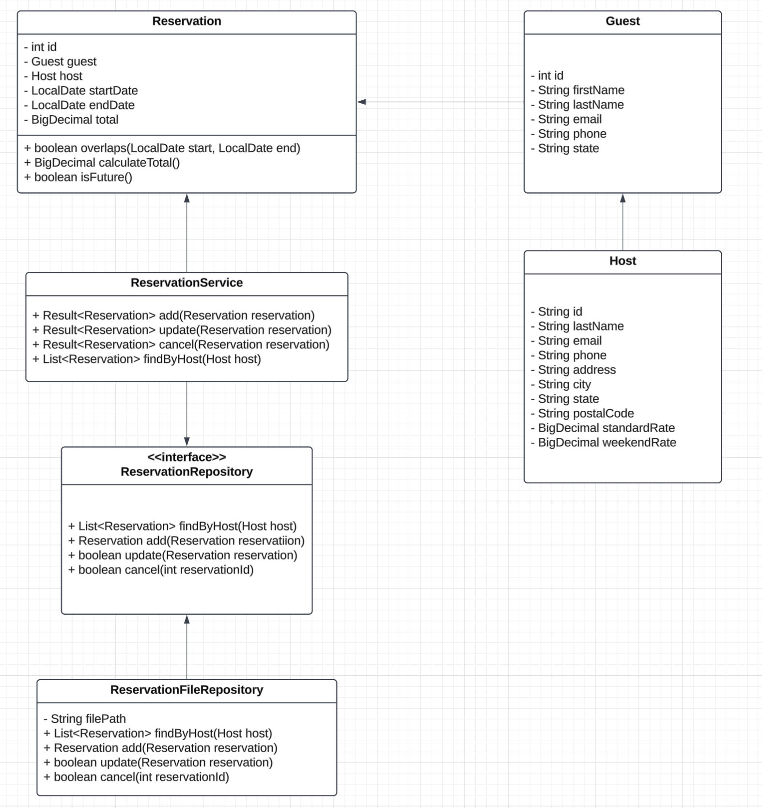
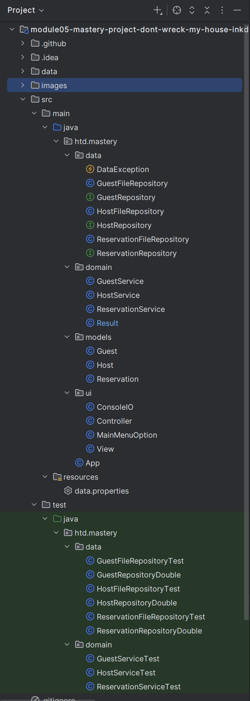

# 🏠 Don't Wreck My House – Project Plan

## HTD Talent Mastery Project
Tony Vazquez
June 2025

## ⏱️ Project Task List

| Task                                   | Estimate    | Actual |
|----------------------------------------|-------------|--------|
| Create project plan                    | 1 day       | 4 hr   |
| Create packages/proj-structure         | 1 hr        | 1 hr   |
| Design model classes                   | 1 hr        |        |
| Implement model classes                | 1 hr        |        |
| Build ReservationRepository interface  | 1 hr        |        |
| Implement ReservationFileRepository    | 2 hr        |        |
| Build ReservationService               | 2.5 hr      |        |
| Test Reservation logic                 | 1 hr        |        |
| Implement Guest/Host repositories      | 1.5 hr      |        |
| Implement Guest/Host services          | 1 hr        |        |
| Build UI                               | 2.5 hr      |        |
| Final testing & polish                 | 1 hr        |        |
| Continue with stretch goals if allowed | 5 hr        |        |
| -------------------------------------- | ----------- | ------ |
| **Total**                              | **23.5 hr** |        |

## Class Diagram

## Class Details 

Reservation: 

    boolean overlaps(LocalDate start, LocalDate end) — returns true if this reservation overlaps a given date range
    BigDecimal calculateTotal() — calculates the total price based on the host’s standard and weekend rates
    boolean isFuture() — returns true if the reservation starts in the future

ReservationService:

    Result<Reservation> add(Reservation reservation) — validates the reservation (dates/overlap), calculates total, and passes it to repository
    Result<Reservation> update(Reservation reservation) — validates and updates a reservation
    Result<Reservation> cancel(int reservationId) — cancels a reservation if valid
    List<Reservation> findByHost(Host host) — retrieves reservations for a host

ReservationRepository(Interface):

    List<Reservation> findByHost(Host host) — retrieves all reservations for a host
    Reservation add(Reservation reservation) — adds a reservation to storage
    boolean update(Reservation reservation) — updates an existing reservation in storage
    boolean cancel(int reservationId) — cancels a reservation

ReservationFileRepository:

    List<Reservation> findByHost(Host host) — retrieves all reservations for a host
    Reservation add(Reservation reservation) — adds a reservation to storage
    boolean update(Reservation reservation) — updates an existing reservation in storage
    boolean cancel(int reservationId) — cancels a reservation

## Project Structure

I prepared for potentially doing stretch goals. 06/03/2025

